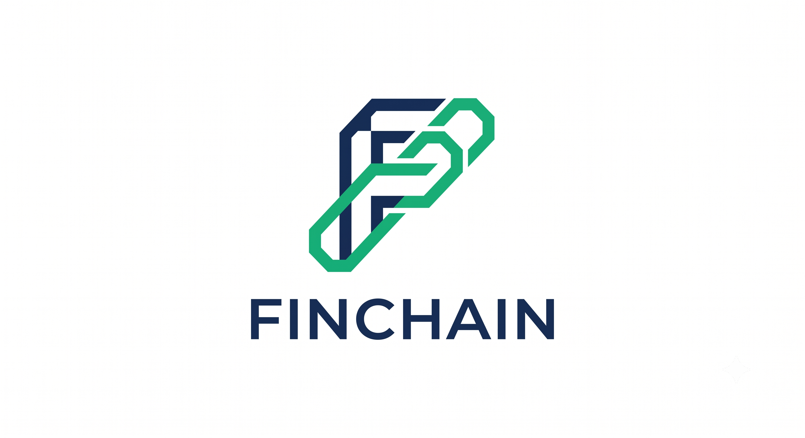

<p align="center">
  
</p>

# 🔐 FinChain Secure Ledger

<p align="center">
  
  
  
  
</p>

<p align="center">
  A console-based finance tracking system built with C++.
</p>

---

## 📑 Table of Contents

- [📖 Overview](#-overview)
- [✨ Features](#-features)
- [📂 Project Structure](#-project-structure)
- [⚙️ How It Works](#️-how-it-works)
- [🚀 Installation](#-installation)
- [🖥️ Usage](#️-usage)
- [🔮 Future Improvements](#-future-improvements)
- [👥 Contributors](#-contributors)

---

## 📖 Overview

FinChain Secure Ledger is a C++ financial management application that allows users to securely manage wallets, record transactions, and monitor financial activity through an interactive command-line interface.

The project was developed to practice software engineering fundamentals, data management, modular programming, and authentication systems.

---

## ✨ Features

### 🔑 Authentication System
- User registration
- User login
- Credential validation

### 💳 Wallet Management
- Create wallet
- View wallet information
- Track balances

### 💸 Transaction System
- Deposit funds
- Withdraw funds
- Transaction history
- Transaction validation

### 📊 Financial Overview
- Account summary
- Balance monitoring
- Activity tracking

### ⚠️ Error Handling
- Invalid input protection
- Safe menu navigation
- Data validation

---

## 📂 Project Structure

```text
FinChain/
│
├── main.cpp
├── authentication.cpp
├── authentication.h
├── wallet.cpp
├── wallet.h
├── transaction.cpp
├── transaction.h
├── dashboard.cpp
├── dashboard.h
└── README.md
```

---

## ⚙️ How It Works

```text
Start
 │
 ├── Sign Up
 │
 ├── Sign In
 │
 └── Dashboard
      │
      ├── Wallet Management
      ├── Transactions
      ├── Financial Overview
      └── Exit 
```

---

## 🚀 Installation

### Clone Repository

```bash
git clone https://github.com/yourusername/finchain.git
cd finchain
```

### Compile

```bash
g++ *.cpp -o finchain
```

### Run

```bash
./finchain
```

---

## 🖥️ Usage

1. Launch the application.
2. Create an account using Sign Up.
3. Sign In using your credentials.
4. Manage wallets and transactions.
5. Monitor your financial activity through the dashboard.

---

## 🔮 Future Improvements

- File/database storage
- Budget planning
- Financial analytics
- Report generation
- Enhanced security
- Multi-user support

---

## 👥 Contributors

| Name                      | Role      |
|---------------------------|-----------|
| NI PUTU AYU DIAN SULASTRI | Developer |

---

## 📄 License

This project was developed for educational purposes.